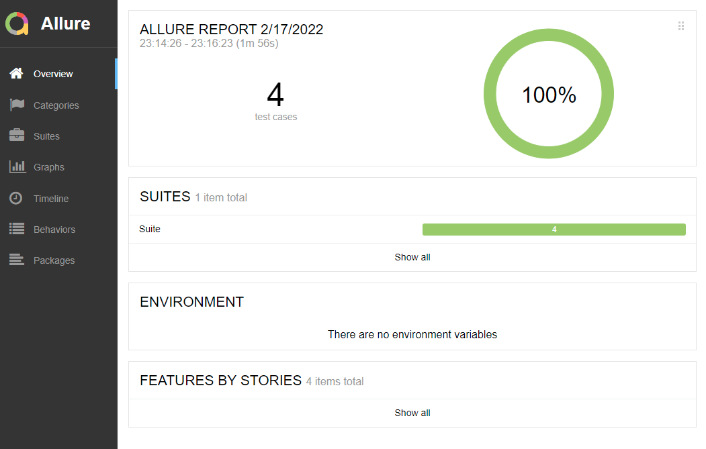
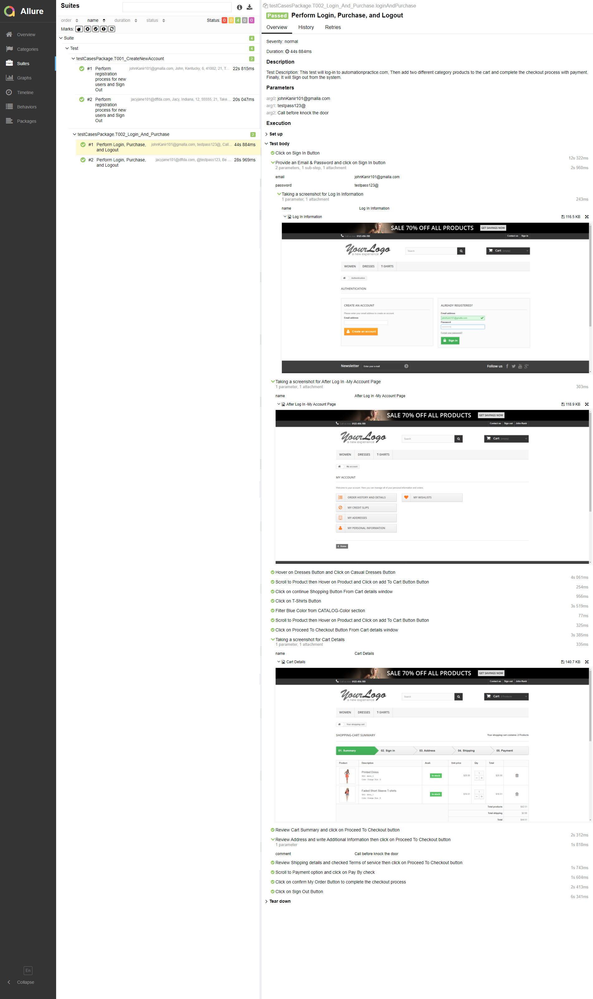

# Automation Practice
This project automates the automationpractice.com website's
multiple new user creation and purchase processes.

## Technology used
  
- Test tool:  Selenium Webdriver 
- Language: Java  
- Architecture: POM
- Reporting tool: Allure
- IDE: Eclipse  

## Pre Requisites:
  
- Open/install Java JDK 8 or Later version on your PC  
- Install Maven on your PC   
- Install Eclipse/STS or any other IDE  
- Setup Java, Maven environment on your PC  
- Chrome Browser

## Requirements:
- Set Configure build path libraries with JRE System Library 1.8 or above 
- Goto to testDataPackage and open DataSet.java file...  
```
    Update email data for every user data for every run 
    johnKanir101@gmalla.com  update like johnKanir102@gmalla.com
    jacyjane101@dffda.com  update like jacyjane102@dffda.com 
``` 
## How to Run the script:
- Right Click on testng.xml file from project home directory
- Then select Run as TestNG

## The Steps executed in these Automation are:
### TestCase 01: T001_CreateNewAccount
- Open the Opera browser.
- Go to automationpractice Web Site.
- Maximize the browser window.
- Click on Sign In Button.
- Provide an Email address and click on create an Account button.
- Provide New User Personal Information.
- Provide New User Address Information.
- Click Register button and complete create new user process.
- Click on Sign Out. 
##### Run above steps again for second user.

### TestCase 02: T002_Login_And_Purchase
- Click on Sign In Button.
- Provide an Email & Password and click on Sign In button
- Hover on Dresses Button and Click on Casual Dresses Button
- Scroll to Product then Hover on Product and Click on add To Cart Button Button
- Click on continue Shopping Button From Cart details window
- Click on T-Shirts Button
- Filter Blue Color from CATALOG-Color section
- Scroll to Product then Hover on Product and Click on add To Cart Button Button
- Click on Proceed To Checkout Button From Cart details window
- Review Cart Summary and click on Proceed To Checkout button
- Review Address and write Additional Information then click on Proceed To Checkout button
- Review Shipping details and checked Terms of service then click on Proceed To Checkout button
- Scroll to Payment option and click on Pay By check
- Click on confirm My Order Button to complete the checkout process
- Click on Sign Out Button
##### Run above steps again for second user.
## Report Screenshot 
### Summary Report

### Create new Account 

### Login and Purchase


 
